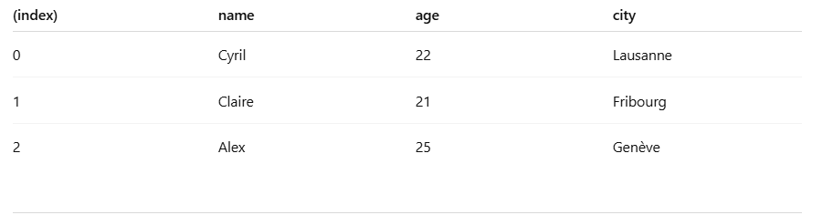

<h1>🤔 RP - 323 - Programmation fonctionnelle</h1>

>[!TIP]
>**Référence Javascript:** <https://developer.mozilla.org/fr/docs/Web/JavaScript/Reference>  
>**Tester du code JS** : <https://runjs.app/play>  
>**Convertir en PDF** : <https://marketplace.visualstudio.com/items?itemName=manuth.markdown-converter>

<h1>Table des matières</h1>

- [Introduction](#introduction)
- [Opérateurs javascript super-cooool 😎](#opérateurs-javascript-super-cooool-)
  - [opérateur `?:`](#opérateur-)
  - [opérateur `??`](#opérateur--1)
  - [opérateur `??=`](#opérateur--2)
  - [opérateur de décomposition 'spread' `...`](#opérateur-de-décomposition-spread-)
  - [Déstructuration](#déstructuration)
- [Date et Heure](#date-et-heure)
  - [Obtenir la date et/ou heure actuelle](#obtenir-la-date-etou-heure-actuelle)
- [Math](#math)
  - [`Math.PI` - la constante π](#mathpi---la-constante-π)
  - [`Math.abs()` - la |valeur absolue| d'un nombre](#mathabs---la-valeur-absolue-dun-nombre)
  - [`Math.pow()` - élever à une puissance](#mathpow---élever-à-une-puissance)
  - [`Math.min()` - plus petite valeur](#mathmin---plus-petite-valeur)
  - [`Math.max()` - plus grande valeur](#mathmax---plus-grande-valeur)
  - [`Math.ceil()` - arrondir à la prochaine valeur entière la plus proche](#mathceil---arrondir-à-la-prochaine-valeur-entière-la-plus-proche)
  - [`Math.floor()` - arrondir à la précédente valeur entière la plus proche](#mathfloor---arrondir-à-la-précédente-valeur-entière-la-plus-proche)
  - [`Math.round()` - arrondir à la valeur entière la plus proche](#mathround---arrondir-à-la-valeur-entière-la-plus-proche)
  - [`Math.trunc()` - supprime la virgule et retourne la partie entière d'un nombre](#mathtrunc---supprime-la-virgule-et-retourne-la-partie-entière-dun-nombre)
  - [`Math.sqrt()` - la raçine carrée d'un nombre](#mathsqrt---la-raçine-carrée-dun-nombre)
  - [`Math.random()` - générer un nombre aléatoire entre 0.0 (compris) et 1.0 (non compris)](#mathrandom---générer-un-nombre-aléatoire-entre-00-compris-et-10-non-compris)
- [JSON](#json)
  - [`JSON.stringify()` - transformer un objet Javascript en JSON](#jsonstringify---transformer-un-objet-javascript-en-json)
  - [`JSON.parse()` - transformer du JSON en objet Javascript](#jsonparse---transformer-du-json-en-objet-javascript)
- [Chaînes de caractères](#chaînes-de-caractères)
  - [`split()` - un ciseau qui coupe une chaîne là où un caractère apparaît et produit un tableau](#split---un-ciseau-qui-coupe-une-chaîne-là-où-un-caractère-apparaît-et-produit-un-tableau)
  - [`trim()`, `trimStart()` et `trimEnd()` - épuration des espaces en trop dans une chaîne (trimming)](#trim-trimstart-et-trimend---épuration-des-espaces-en-trop-dans-une-chaîne-trimming)
  - [`padStart()` et `padEnd()` - aligner le contenu dans une chaîne de caractères](#padstart-et-padend---aligner-le-contenu-dans-une-chaîne-de-caractères)
- [Console](#console)
  - [`console.log()` - Afficher un message sur la console](#consolelog---afficher-un-message-sur-la-console)
  - [`console.info()`, `warn()` et `error()` - Afficher un message sur la console (filtrables)](#consoleinfo-warn-et-error---afficher-un-message-sur-la-console-filtrables)
  - [`console.table()` - Afficher tout un tableau ou un objet sur la console](#consoletable---afficher-tout-un-tableau-ou-un-objet-sur-la-console)
  - [`console.time()`, `timeLog()` et `timeEnd()` - Chronométrer une durée d'exécution](#consoletime-timelog-et-timeend---chronométrer-une-durée-dexécution)
- [Tableaux](#tableaux)
  - [`forEach` - parcourir les éléments d'un tableau](#foreach---parcourir-les-éléments-dun-tableau)
  - [`entries()` - parcourir les couples index/valeurs d'un tableau](#entries---parcourir-les-couples-indexvaleurs-dun-tableau)
  - [`in` - parcourir les clés d'un tableau](#in---parcourir-les-clés-dun-tableau)
  - [`of` - parcourir les valeurs d'un tableau](#of---parcourir-les-valeurs-dun-tableau)
  - [`find()` - premier élément qui satisfait une condition](#find---premier-élément-qui-satisfait-une-condition)
  - [`findIndex()` - premier index qui satisfait une condition](#findindex---premier-index-qui-satisfait-une-condition)
  - [`indexOf()` et `lastIndexOf()` - premier/dernier élément qui correspond](#indexof-et-lastindexof---premierdernier-élément-qui-correspond)
  - [`push()`, `pop()`, `shift()` et `unshift()` - ajouter/supprime au début/fin dans un tableau](#push-pop-shift-et-unshift---ajoutersupprime-au-débutfin-dans-un-tableau)
  - [`slice()` - ne conserver que certaines lignes d'un tableau](#slice---ne-conserver-que-certaines-lignes-dun-tableau)
  - [`splice()` - supprimer/insérer/remplacer des valeurs dans un tableau](#splice---supprimerinsérerremplacer-des-valeurs-dans-un-tableau)
  - [`concat()` - joindre deux tableaux](#concat---joindre-deux-tableaux)
  - [`join()` - joindre des chaînes de caractères](#join---joindre-des-chaînes-de-caractères)
  - [`keys()` et `values()` - les clés/valeurs d'un objet](#keys-et-values---les-clésvaleurs-dun-objet)
  - [`includes()` - vérifier si une valeur est présente dans un tableau](#includes---vérifier-si-une-valeur-est-présente-dans-un-tableau)
  - [`every()` et `some()` - vérifier si plusieurs valeurs sont toutes/quelques présentes dans un tableau](#every-et-some---vérifier-si-plusieurs-valeurs-sont-toutesquelques-présentes-dans-un-tableau)
  - [`fill()` - remplir un tableau avec des valeurs](#fill---remplir-un-tableau-avec-des-valeurs)
  - [`flat()` - aplatir un tableau](#flat---aplatir-un-tableau)
  - [`sort()` - pour trier un tableau](#sort---pour-trier-un-tableau)
  - [`map()` - tableau avec les résultats d'une fonction](#map---tableau-avec-les-résultats-dune-fonction)
  - [`filter()` - tableau avec les éléments passant un test](#filter---tableau-avec-les-éléments-passant-un-test)
  - [`groupBy()` - regroupe les éléments d'un tableau selon un règle](#groupby---regroupe-les-éléments-dun-tableau-selon-un-règle)
  - [`flatMap()` - chaînage de map() et flat()](#flatmap---chaînage-de-map-et-flat)
  - [`reduce()` et `reduceRight()` - réduire un tableau à une seule valeur](#reduce-et-reduceright---réduire-un-tableau-à-une-seule-valeur)
  - [`reverse()` - inverser l'ordre du tableau](#reverse---inverser-lordre-du-tableau)
- [Techniques](#techniques)
  - [\`\`(backticks) - pour des expressions intelligentes](#backticks---pour-des-expressions-intelligentes)
  - [`new Set()` - pour supprimer les doublons](#new-set---pour-supprimer-les-doublons)
- [Fonctions](#fonctions)
  - [Déclaration de fonction](#déclaration-de-fonction)
  - [Fonctions immédiatement invoquées (IIFE)](#fonctions-immédiatement-invoquées-iife)
- [Conclusion](#conclusion)

<svg height="12" width="100%" style="padding-top:2em;padding-bottom:1em">
  <rect y="5" width="100%" height="5" fill="#7191B8"/>
</svg>

# Introduction

Dans ce module nous allons voir la programmation fonctionnelle. Les objectifs opérationnels du module sont les suivants:  
- alyser et décrire les exigences en vue de la réalisation d'une programmation fonctionnelle.  
- Implémenter de manière efficiente des algorithmes et des problèmes d’applications selon le paradigme de programmation fonctionnelle et les exigences données.  
-  Améliorer et optimiser le code impératif implémenté en utilisant la 
programmation fonctionnelle (refactorisation).  
- Vérifier l’exactitude et la qualité de l’implémentation.


# Opérateurs javascript super-cooool 😎

## opérateur `?:`

> L'expression `question?valeur1:valeur2` retournera `valeur1` si `question` vaut `true` sinon elle retournera `valeur2`.

```javascript
const age = 15;
const resultat = age >= 18 ? 'majeur' : 'mineur'; // 'mineur'
```

## opérateur `??`

Cet opérateur logique se nomme l'opérateur de "coalescence des nuls".

> Renvoie son opérande de droite lorsque son opérande de gauche vaut `null` ou `undefined` et qui renvoie son opérande de gauche sinon.

```javascript
const foo1 = null ?? 'default'; // "default"
const foo2 = 0 ?? 42; // 0
```

>[!CAUTION]
>Contrairement à l'opérateur logique OU (`||`), l'opérande de gauche sera également renvoyé s'il s'agit d'une valeur équivalente à `false` et pas seulement `null` et `undefined`.
>
>⚠️ En d'autres termes **ATTENTION** ‼️ lors de l'utilisation de `||` pour fournir une valeur par défaut à une variable, car on peut rencontrer des comportements inattendus lorsqu'on considère certaines valeurs comme correctes et utilisables (par exemple une chaine vide `''` ou `0`) ‼️

```javascript
const foo3 = 0 || 42; // 42 => ATTENTION !
const foo4 = 1 || 42; // 1
const foo5 = null || 'salut !'; // 'salut !'
const foo6 = '' || 'salut !'; // 'salut !' => ATTENTION !
```

## opérateur `??=`

Cet opérateur logique se nomme l'opérateur d'affectation de "coalescence des nuls", également connu sous le nom d'opérateur affectation logique nulle.

> Évalue l'opérande de droite et l'attribue à gauche **UNIQUEMENT si l'opérande de gauche est nulle** (`null` ou `undefined`).

```javascript
const a = { duration: 50 };
a.duration ??= 10; // pas fait
a.speed ??= 25; // fait => { duration: 50, speed: 25 }
```

## opérateur de décomposition 'spread' `...`

L'opérateur de décomposition spread `...` permet de décomposer un itérable (comme un tableau) en en ses éléments distincts. Cela permet de rapidement copier tout ou une partie d'un tableau existant dans un autre tableau ou d'en extraire facilement des parties.

```javascript
// Combiner des valeurs existantes dans un nouveau tableau
const numbersOne = [1, 2, 3];
const numbersTwo = [4, 5, 6];
const numbersCombined = [...numbersOne, ...numbersTwo];

// Extraire uniquement ce qui est utile d'un tableau
const numbers = [1, 2, 3, 4, 5, 6];
const [one, two, ...rest] = numbers;

// Mariage d'objets avec mise à jour :-)
const myVehicle = {
    brand: 'Ford',
    model: 'Mustang',
    color: 'red',
};
const updateMyVehicle = {
    type: 'car',
    year: 2021,
    color: 'yellow',
};
const myUpdatedVehicle = { ...myVehicle, ...updateMyVehicle };
```

## Déstructuration

L'opérateur de décomposition spread `...` sert aussi à isoler certains éléments afin de les utiliser ensuite, et de **mettre le reste** d'un coup ailleurs.

```javascript
const valeurs = [1, 2, 3, 4, 5, 6, 7, 8, 9, 10];
const [a, b, ...c] = valeurs;
console.log(a); // 1
console.log(b); // 2
console.log(c); // [3, 4, 5, 6, 7, 8, 9, 10]
```

<svg height="12" width="100%" style="padding-top:2em;padding-bottom:1em">
  <rect y="5" width="100%" height="5" fill="#7191B8"/>
</svg>

# Date et Heure

Lien vers la documentation officielle : [https://developer.mozilla.org/fr/docs/Web/JavaScript/Reference/Global_Objects/Date](https://developer.mozilla.org/fr/docs/Web/JavaScript/Reference/Global_Objects/Date)

## Obtenir la date et/ou heure actuelle

```javascript
const maintenant = new Date(); // Obtenir l'un comme l'autre

console.log(maintenant.toLocaleDateString()); // ex: "06.06.2025"
console.log(maintenant.toLocaleTimeString()); // ex: "15:23:42"

const jour = maintenant.getDate();
const mois = maintenant.getMonth() + 1; // Attention : janvier = 0
const annee = maintenant.getFullYear();
const heure = maintenant.getHours();
const minute = maintenant.getMinutes();
const seconde = maintenant.getSeconds();
console.log(`${jour}/${mois}/${annee} - ${heure}h${minute}`);

// Au format ISO (standard international)
console.log(maintenant.toISOString()); // ex: "2025-06-06T13:23:42.123Z"
```  
## Convertir une chaine de caractère en Date  
```javascript
//Conversion de String en date
const dateEnString = "19.08.2024";
const [day, month, year] = dateEnString.split('.');
const dateFormatDate= new Date(year, month-1, day);


// Affichage de l'année, mois et jour
console.log(dateFormatDate.getFullYear()); // 2024
console.log(dateFormatDate.getMonth() + 1); // 8
console.log(dateFormatDate.getDate()); // 19
```  

## Convertir une date en chaine de caractère  
```javascript
// 🔁 Reconvertir en string "JJ.MM.AAAA"
const jour = String(dateFormatDate.getDate()).padStart(2, "0");
const mois = String(dateFormatDate.getMonth() + 1).padStart(2, "0");
const annee = dateFormatDate.getFullYear();

const dateReconvertie = `${jour}.${mois}.${annee}`;

console.log(dateReconvertie);
```

<svg height="12" width="100%" style="padding-top:2em;padding-bottom:1em">
  <rect y="5" width="100%" height="5" fill="#7191B8"/>
</svg>

# Math

Lien vers la documentation officielle : [https://developer.mozilla.org/fr/docs/Web/JavaScript/Reference/Global_Objects/Math](https://developer.mozilla.org/fr/docs/Web/JavaScript/Reference/Global_Objects/Math)

## `Math.PI` - la constante π

Représente la valeur de π (3.1415).

```javascript
const pi = Math.PI

console.log(pi) // // 3.141592653589793
```

## `Math.abs()` - la \|valeur absolue\| d'un nombre

Renvoie la valeur absolue d'un nombre (Sa valeur positive).

```javascript
const valeurAbsoluDeNombreNegatif = Math.abs(-5);
const valeurAbsoluDeNombrePositif = Math.abs(3);

console.log([valeurAbsoluDeNombreNegatif, valeurAbsoluDeNombrePositif])  //[5,3]
```

## `Math.pow()` - élever à une puissance

Élève un nombre à la puissance donnée.
Math.pow(base, exposant) = base^exposant

```javascript
const exemple1 = Math.pow(2, 3); // 8   (2³)
const exemple2 = Math.pow(3, 4); // 81  (3⁴)


console.log({exemple1, exemple2}) // {exemple1: 8, exemple 2: 81}
```

## `Math.min()` - plus petite valeur

Renvoie le plus petit nombre parmi les arguments.

```javascript
const valeur1 = 2;
const valeur2 = 26;
const valeur3 = 8;
const valeur4 = 233;


const valeurMin = Math.min(valeur1, valeur2, valeur3, valeur4)// 2
```

## `Math.max()` - plus grande valeur

Renvoie le plus grand nombre parmi les arguments.

```javascript
const valeur1 = 2;
const valeur2 = 26;
const valeur3 = 8;
const valeur4 = 233;


const valeurMax = Math.max(valeur1, valeur2, valeur3, valeur4)// 233
```

## `Math.ceil()` - arrondir à la prochaine valeur entière la plus proche

Arrondit à l’entier supérieur le plus proche.

```javascript
Math.ceil(4.1);    // 5
Math.ceil(-4.1);   // -4


Math.ceil(-4.9)//-4
```

## `Math.floor()` - arrondir à la précédente valeur entière la plus proche

Arrondit à l’entier inférieur le plus proche.

```javascript
Math.floor(4.9);   // 4
Math.floor(-4.9);  // -5
Math.floor(-4.1) // -5
```

## `Math.round()` - arrondir à la valeur entière la plus proche

Arrondit à l’entier le plus proche.
(.5 → vers le haut)

```javascript
Math.round(4.4);   // 4
Math.round(4.5);   // 5
Math.round(-4.4)// -4
Math.round(-4.5)// -4
```

## `Math.trunc()` - supprime la virgule et retourne la partie entière d'un nombre

Renvoie uniquement la partie entière, sans arrondi.

```javascript
Math.trunc(4.9);   // 4
Math.trunc(-4.9);  // -4

```

## `Math.sqrt()` - la raçine carrée d'un nombre

Renvoie la racine carrée d’un nombre.

```javascript
Math.sqrt(9);      // 3
Math.sqrt(2);      // 1.41421356237...

```

## `Math.random()` - générer un nombre aléatoire entre 0.0 (compris) et 1.0 (non compris)

Renvoie un nombre pseudo-aléatoire entre 0 (inclus) et 1 (exclu).

```javascript
Math.random();  // ex: 0.54738912
// Pour un nombre entre 0 et 10 :
Math.random() * 10; // ex: 7.2389
// Pour un entier entre 1 et 10 :
Math.floor(Math.random() * 10) + 1;

```

<svg height="12" width="100%" style="padding-top:2em;padding-bottom:1em">
  <rect y="5" width="100%" height="5" fill="#7191B8"/>
</svg>

# JSON

Lien vers la documentation officielle : [https://developer.mozilla.org/fr/docs/Web/JavaScript/Reference/Global_Objects/JSON](https://developer.mozilla.org/fr/docs/Web/JavaScript/Reference/Global_Objects/JSON)

## `JSON.stringify()` - transformer un objet Javascript en JSON

Convertit un objet, tableau ou valeur JavaScript en une chaîne de texte au format JSON.

```javascript
const user = { name: "Cyril", age: 22, active: true };
const json = JSON.stringify(user);

console.log(json);
// → '{"name":"Cyril","age":22,"active":true}'

```

```javascript
const notes = [5, 4.5, 6, 3.8];
const json = JSON.stringify(notes);

console.log(json);
// → '[5,4.5,6,3.8]'

```

```javascript
const users = [
  { name: "Cyril", age: 22 },
  { name: "Claire", age: 21 }
];
const json = JSON.stringify(users);

console.log(json);
// → '[{"name":"Cyril","age":22},{"name":"Claire","age":21}]'

```

## `JSON.parse()` - transformer du JSON en objet Javascript

Fait l’inverse de JSON.stringify() :
convertit une chaîne JSON en un objet JavaScript utilisable.

```javascript
const json = '{"name":"Cyril","age":22}';
const user = JSON.parse(json);

console.log(user.name); // "Cyril"
console.log(user.age);  // 22

```  
Attention :

La chaîne doit être du vrai JSON → guillemets doubles " ", pas simples ' '.  
Sinon JSON.parse() lancera une erreur.

<svg height="12" width="100%" style="padding-top:2em;padding-bottom:1em">
  <rect y="5" width="100%" height="5" fill="#7191B8"/>
</svg>

# Chaînes de caractères

Lien vers la documentation officielle : [https://developer.mozilla.org/fr/docs/Web/JavaScript/Reference/Global_Objects/String](https://developer.mozilla.org/fr/docs/Web/JavaScript/Reference/Global_Objects/String)

## `split()` - un ciseau qui coupe une chaîne là où un caractère apparaît et produit un tableau

Découpe une chaîne à chaque occurrence du séparateur indiqué et renvoie un tableau des morceaux.

```javascript
const phrase = "un,deux,trois";
const mots = phrase.split(",");

console.log(mots); // ["un", "deux", "trois"]

```

## `trim()`, `trimStart()` et `trimEnd()` - épuration des espaces en trop dans une chaîne (trimming)

trim() : enlève les espaces au début et à la fin.

trimStart() : enlève seulement au début.

trimEnd() : enlève seulement à la fin.

```javascript
const texte = "   bonjour   ";

console.log(texte.trim());       // "bonjour"
console.log(texte.trimStart());  // "bonjour   "
console.log(texte.trimEnd());    // "   bonjour"

```

## `padStart()` et `padEnd()` - aligner le contenu dans une chaîne de caractères

Ajoute des caractères de remplissage au début (padStart) ou à la fin (padEnd) jusqu’à atteindre une certaine longueur.

```javascript
const num = "7";

console.log(num.padStart(3, "0")); // "007"
console.log(num.padEnd(3, "-"));   // "7--"

```

<svg height="12" width="100%" style="padding-top:2em;padding-bottom:1em">
  <rect y="5" width="100%" height="5" fill="#7191B8"/>
</svg>

# Console

Lien vers la documentation officielle : [https://developer.mozilla.org/fr/docs/Web/API/console](https://developer.mozilla.org/fr/docs/Web/API/console)

## `console.log()` - Afficher un message sur la console

```javascript
console.log('Coucou !'); // Coucou !
```

## `console.info()`, `warn()` et `error()` - Afficher un message sur la console (filtrables)

Permettent d’afficher des messages avec différents niveaux d’importance, faciles à filtrer dans la console du navigateur.

```javascript
console.info("Info : tout se passe bien ✅");
console.warn("Attention : valeur inhabituelle ⚠️");
console.error("Erreur : quelque chose s'est mal passé ❌");

```

## `console.table()` - Afficher tout un tableau ou un objet sur la console

Affiche les objets ou tableaux d’objets dans une table structurée, avec des colonnes et des lignes, ce qui rend la lecture beaucoup plus claire qu’un simple console.log().

```javascript
const users = [
  { name: "Cyril", age: 22, city: "Lausanne" },
  { name: "Claire", age: 21, city: "Fribourg" },
  { name: "Alex", age: 25, city: "Genève" }
];

console.table(users);

```  
résultat dans la console:  
  

## `console.time()`, `timeLog()` et `timeEnd()` - Chronométrer une durée d'exécution

Permettent de mesurer le temps d’exécution d’un bloc de code.

```javascript
console.time("test");

for (let i = 0; i < 1_000_000; i++) {} // boucle à chronométrer

console.timeLog("test"); // affiche le temps écoulé jusqu’ici
console.timeEnd("test"); // affiche le temps total et arrête le chrono

```

<svg height="12" width="100%" style="padding-top:2em;padding-bottom:1em">
  <rect y="5" width="100%" height="5" fill="#7191B8"/>
</svg>

# Tableaux

Lien vers la documentation officielle : [https://developer.mozilla.org/fr/docs/Web/JavaScript/Reference/Global_Objects/Array](https://developer.mozilla.org/fr/docs/Web/JavaScript/Reference/Global_Objects/Array)

## `forEach` - parcourir les éléments d'un tableau

But : exécuter une fonction pour chaque élément du tableau.  
forEach ne retourne rien (il sert juste à “faire quelque chose” à chaque passage).

```javascript
const fruits = ["pomme", "banane", "cerise"];

fruits.forEach((fruit, index) => {
  console.log(index, fruit);
});

```
Résultat dans la console:  
0 "pomme"  
1 "banane"  
2 "cerise"  

## `entries()` - parcourir les couples index/valeurs d'un tableau

But : récupérer à la fois l’index et la valeur de chaque élément.

```javascript
const lettres = ["a", "b", "c"];

for (const [index, valeur] of lettres.entries()) {
  console.log(index, valeur);
}

```
lettres.entries() crée un itérateur qui produit des couples [index, valeur].

[0, "a"], [1, "b"], [2, "c"].

La boucle for...of déstructure directement ces paires pour afficher :  
```css
0 a
1 b
2 c

```


## `in` - parcourir les clés d'un tableau

But : parcourir les indices (les positions des éléments).

```javascript
const lettres = ["a", "b", "c"];

for (const i in lettres) {
  console.log(i);
}
/*
Résultat dans la console :
0
1
2
*/
```  

```javascript
const personne = {
  nom: "Hohl",
  prénom: "Cyril",
  age: 28,
  sexe: "H"
};


for (const cle in personne) {
  console.log(cle); // "nom", "prénom", "age", "sexe"
}

```

```javascript
const personnes = [
  { nom: "Hohl", prénom: "Cyril", ... },
  { nom: "Test", prénom: "Blabla", ... }
]


// La boucle "for...in" parcourt les indices du tableau
for (const i in personnes) {
  console.log("Indice :", i);
  console.log("Valeur :", personnes[i]);
}

/*
Résultat :
Indice : 0
Valeur : { nom: "Hohl", prénom: "Cyril", age: 28, sexe: "H" }

Indice : 1
Valeur : { nom: "Test", prénom: "Blabla", age: 78, sexe: "F" }
*/
```

## `of` - parcourir les valeurs d'un tableau

But : parcourir directement les valeurs (plus simple que for...in).  

```javascript
const lettres = ["a", "b", "c"];

// La boucle "for...of" parcourt directement les VALEURS du tableau
for (const valeur of lettres) {
  console.log(valeur);
}

/*
Résultat dans la console :
a
b
c
*/


```  

```javascript
const personnes = [
  { nom: "Hohl", prénom: "Cyril", age: 28, sexe: "H" },
  { nom: "Test", prénom: "Blabla", age: 78, sexe: "F" }
];


for (const personne of personnes) {
  console.log(personne.nom, personne.prénom);
}

/*
Résultat :
Hohl Cyril
Test Blabla
*/

```

## `find()` - premier élément qui satisfait une condition

Permet de trouver le premier élément dans un tableau qui respecte une condition

```javascript
const notes = [3, 8, 12, 18];
const bonneNote = notes.find((n) => n >= 10);

console.log(bonneNote); // 12

```  
Si aucun élément respecte la condition, ça renvoie undefined.

## `findIndex()` - premier index qui satisfait une condition

Permet de trouver le premier index qui respecte une condition.

```javascript
const notes = [3, 8, 12, 18];
const index = notes.findIndex(n => n >= 10);

console.log(index); // 2

```

## `indexOf()` et `lastIndexOf()` - premier/dernier élément qui correspond

indexOf() → renvoie l’index de la première occurrence d’une valeur dans un tableau.

lastIndexOf() → renvoie l’index de la dernière occurrence de cette valeur.

Si la valeur n’est pas trouvée, elles renvoient -1.

```javascript
const lettres = ["a", "b", "a", "c"];

console.log(lettres.indexOf("a"));      // 0 (premier "a")
console.log(lettres.lastIndexOf("a"));  // 2 (dernier "a")
console.log(lettres.indexOf("z"));      // -1 (non trouvé)

```

## `push()`, `pop()`, `shift()` et `unshift()` - ajouter/supprime au début/fin dans un tableau

push() → ajoute à la fin

pop() → supprime à la fin

unshift() → ajoute au début

shift() → supprime au début

```javascript
const fruits = ["pomme", "banane"];
fruits.push("cerise");   // ["pomme", "banane", "cerise"]
fruits.pop();            // ["pomme", "banane"]
fruits.unshift("kiwi");  // ["kiwi", "pomme", "banane"]
fruits.shift();          // ["pomme", "banane"]

```

## `slice()` - ne conserver que certaines lignes d'un tableau

Permet de copier une partie d’un tableau dans un nouveau tableau.
Ne modifie pas le tableau d’origine.

```javascript
const lettres = ["a", "b", "c", "d", "e"];
const extrait = lettres.slice(1, 4); // ["b", "c", "d"]

```
Le premier argument = indice de départ (inclus),
le second = indice de fin (exclu).
## `splice()` - supprimer/insérer/remplacer des valeurs dans un tableau

Méthode très puissante qui modifie directement le tableau.
Elle peut :

supprimer des éléments,

insérer de nouveaux éléments,

ou remplacer des éléments existants.

```javascript
const nombres = [1, 2, 3, 4, 5];
nombres.splice(1, 2, "x", "y"); // supprime 2 éléments à partir de l’indice 1 et ajoute "x", "y"
console.log(nombres); // [1, "x", "y", 4, 5]

```

Syntaxe : .splice(indexDépart, nbSupprimés, ...élémentsAjoutés)

## `concat()` - joindre deux tableaux

Renvoie un nouveau tableau combinant plusieurs tableaux sans les modifier.

```javascript
const a = [1, 2];
const b = [3, 4];
const c = a.concat(b); // [1, 2, 3, 4]

```

## `join()` - joindre des chaînes de caractères

Assemble tous les éléments du tableau dans une chaîne de caractères, séparés par le délimiteur choisi.

```javascript
const lettres = ["a", "b", "c"];
console.log(lettres.join("-")); // "a-b-c"

```

## `keys()` et `values()` - les clés/valeurs d'un objet

Object.keys(obj) → renvoie un tableau contenant les clés.

Object.values(obj) → renvoie un tableau contenant les valeurs.

```javascript
const user = { nom: "Cyril", age: 28 };
console.log(Object.keys(user));   // ["nom", "age"]
console.log(Object.values(user)); // ["Cyril", 28]

```

```javascript
const users = [
  { nom: "Cyril", age: 28 },
  { nom: "Test", age: 56 }
];

// On parcourt chaque objet du tableau
for (const user of users) {
  console.log("------ Utilisateur ------");
  console.log("Clés :", Object.keys(user));     // ["nom", "age"]
  console.log("Valeurs :", Object.values(user)); // ["Cyril", 28] puis ["Test", 56]
}

```

résultat:  
```yaml
--- Utilisateur ---
nom : Cyril
age : 28
--- Utilisateur ---
nom : Test
age : 56

```

## `includes()` - vérifier si une valeur est présente dans un tableau

Renvoie true ou false selon la présence d’un élément dans le tableau.

```javascript
const fruits = ["pomme", "banane"];
console.log(fruits.includes("pomme")); // true
console.log(fruits.includes("kiwi"));  // false

```

## `every()` et `some()` - vérifier si plusieurs valeurs sont toutes/quelques présentes dans un tableau

every() → tous doivent passer le test.

some() → au moins un doit passer.

```javascript
const notes = [15, 12, 8];
console.log(notes.every(n => n >= 10)); // false (pas tous ≥ 10)
console.log(notes.some(n => n >= 10));  // true (au moins un ≥ 10)

```

## `fill()` - remplir un tableau avec des valeurs

Modifie le tableau en mettant la même valeur à chaque position.

```javascript
const tableau1 = [7, 5, 9, 2];
const tableau2 = [...tableau1].fill(9);

console.log(tableau1); // [7, 5, 9, 2]
console.log(tableau2); // [9, 9, 9, 9]


```

## `flat()` - aplatir un tableau

Fusionne les sous-tableaux en un seul tableau plat.
On peut spécifier le niveau de profondeur.

```javascript
const arr = [1, [2, 3], [4, [5]]];
console.log(arr.flat(2)); // [1, 2, 3, 4, 5]

```
flat(1) (par défaut) enlève un seul niveau.
## `sort()` - pour trier un tableau

Trie les éléments par ordre alphabétique par défaut (comme du texte).
Pour un tri numérique, il faut fournir une fonction de comparaison.

```javascript
const nombres = [3, 1, 4, 2];
nombres.sort((a, b) => a - b); // [1, 2, 3, 4]

```

## `map()` - tableau avec les résultats d'une fonction

array.map() permet de créer un nouveau tableau à partir d’un tableau existant,
en appliquant une fonction à chaque élément.

```javascript
const nombres = [1, 2, 3, 4];
const doubles = nombres.map((n) => {
  return n * 2

});

console.log(doubles); // [2, 4, 6, 8]

```

```javascript
const utilisateurs = [
  { nom: "Alice", age: 25 },
  { nom: "Bob", age: 30 }
];

const noms = utilisateurs.map((u) =>{
  return u.nom
});
console.log(noms); // ["Alice", "Bob"]

```  

```javascript
const utilisateurs = [
  { nom: "Alice", age: 25 },
  { nom: "Bob", age: 30 }
];

const noms = utilisateurs.map((u) => {
  return { nom: u.nom }
  });

console.log(noms); 
// ➜ [ { nom: "Alice" }, { nom: "Bob" } ]

```

```javascript
const utilisateurs = [
  { nom: "Alice", age: 25 },
  { nom: "Bob", age: 30 }
];

const noms = utilisateurs.map((u) => {
  const majeur = u.age >= 18;
  return { ...u, majeur };
});

console.log(noms);
// ➜ [ 
//   { nom: "Alice", age: 25, majeur: true },
//   { nom: "Bob", age: 30, majeur: true }
// ]


```

## `filter()` - tableau avec les éléments passant un test

Crée un nouveau tableau avec les éléments qui respectent la condition.

```javascript
const nombres = [1, 5, 8, 2];
const grands = nombres.filter((n) =>{return n > 4}); // [5, 8]

```

## `groupBy()` - regroupe les éléments d'un tableau selon un règle

Regroupe les éléments d’un tableau dans un objet selon une clé calculée.

```javascript
const personnes = [
  { nom: "Cyril", age: 28 },
  { nom: "Claire", age: 28 },
  { nom: "John", age: 30 }
];

const groupes = personnes.groupBy(personne => personne.age);

console.log(groupes);
// ➜ {
//   28: [ { nom: "Cyril", age: 28 }, { nom: "Claire", age: 28 } ],
//   30: [ { nom: "John", age: 30 } ]
// }


```

## `flatMap()` - chaînage de map() et flat()

Transforme chaque élément avec map() puis aplatie le résultat d’un niveau.

```javascript
const mots = ["bonjour", "toi"];
const lettres = mots.flatMap((mot) =>{return mot.split("")} );
// ["b","o","n","j","o","u","r","t","o","i"]

```

.map() transforme chaque mot en un tableau de lettres :

"bonjour" → ["b","o","n","j","o","u","r"]

"toi" → ["t","o","i"]  

Donc après le .map():  

```javascript
[ ["b","o","n","j","o","u","r"], ["t","o","i"] ]

```

Puis .flatMap() aplatit automatiquement d’un niveau :  
["b","o","n","j","o","u","r","t","o","i"]


## `reduce()` et `reduceRight()` - réduire un tableau à une seule valeur

Applique une fonction cumulatrice sur tous les éléments du tableau.

reduce() → de gauche à droite

reduceRight() → de droite à gauche

```javascript
const nombres = [1, 2, 3, 4];
const somme = nombres.reduce((accumulateurSommeChiffre, chiffreCourrant) => {
    accumulateurSommeChiffre += chiffreCourrant;
    return accumulateurSommeChiffre
}, 0); // 10

```

```javascript
const lettres = ["a", "b", "c"];

const concatReduce = lettres.reduce((acc, val) => acc + val);
const concatReduceRight = lettres.reduceRight((acc, val) => acc + val);

console.log(concatReduce);      // "abc"
console.log(concatReduceRight); // "cba"

```

## `reverse()` - inverser l'ordre du tableau

Inverse en place les éléments du tableau.

```javascript
const lettres = ["a", "b", "c"];
lettres.reverse(); // ["c", "b", "a"]

```

Modifie le tableau original (contrairement à certaines méthodes qui en créent un nouveau).
## Tableau résumé

|  **Méthode**  |  **Effet / Utilité**                           |  **Modifie le tableau ?** |  **Exemple rapide**                                       |
| --------------- | ------------------------------------------------ | --------------------------- | ----------------------------------------------------------- |
| `push()`        | Ajoute un ou plusieurs éléments à la **fin**     | ✅ Oui                       | `[1,2].push(3)` → `[1,2,3]`                                 |
| `pop()`         | Supprime le **dernier** élément                  | ✅ Oui                       | `[1,2,3].pop()` → `[1,2]`                                   |
| `unshift()`     | Ajoute au **début**                              | ✅ Oui                       | `[2,3].unshift(1)` → `[1,2,3]`                              |
| `shift()`       | Supprime le **premier** élément                  | ✅ Oui                       | `[1,2,3].shift()` → `[2,3]`                                 |
| `slice()`       | Copie une portion du tableau (début, fin)        | ❌ Non                       | `["a","b","c"].slice(1,3)` → `["b","c"]`                    |
| `splice()`      | Supprime / insère / remplace des éléments        | ✅ Oui                       | `[1,2,3].splice(1,1,"x")` → `[1,"x",3]`                     |
| `concat()`      | Fusionne plusieurs tableaux                      | ❌ Non                       | `[1,2].concat([3,4])` → `[1,2,3,4]`                         |
| `join()`        | Transforme un tableau en **chaîne**              | ❌ Non                       | `["a","b"].join("-")` → `"a-b"`                             |
| `includes()`    | Vérifie si une valeur est présente               | ❌ Non                       | `[1,2,3].includes(2)` → `true`                              |
| `indexOf()`     | Trouve la **première position** d’une valeur     | ❌ Non                       | `["a","b","a"].indexOf("a")` → `0`                          |
| `lastIndexOf()` | Trouve la **dernière position** d’une valeur     | ❌ Non                       | `["a","b","a"].lastIndexOf("a")` → `2`                      |
| `every()`       | Vérifie si **tous** les éléments passent le test | ❌ Non                       | `[2,4,6].every(n=>n%2===0)` → `true`                        |
| `some()`        | Vérifie si **au moins un** passe le test         | ❌ Non                       | `[1,3,4].some(n=>n%2===0)` → `true`                         |
| `fill()`        | Remplit avec une valeur                          | ✅ Oui                       | `[1,2,3].fill(0)` → `[0,0,0]`                               |
| `flat()`        | Aplatit les sous-tableaux                        | ❌ Non                       | `[1,[2,3]].flat()` → `[1,2,3]`                              |
| `sort()`        | Trie les éléments                                | ✅ Oui                       | `[3,1,2].sort()` → `[1,2,3]`                                |
| `map()`         | Transforme chaque élément (nouveau tableau)      | ❌ Non                       | `[1,2].map(n=>n*2)` → `[2,4]`                               |
| `filter()`      | Garde les éléments qui passent un test           | ❌ Non                       | `[1,5,8].filter(n=>n>4)` → `[5,8]`                          |
| `groupBy()`     | Regroupe selon une clé (ES2023)                  | ❌ Non                       | `Object.groupBy(arr, f)` → `{clé:[...]}`                    |
| `flatMap()`     | Combine `map()` + `flat()`                       | ❌ Non                       | `["ab","cd"].flatMap(x=>x.split(""))` → `["a","b","c","d"]` |
| `reduce()`      | Réduit à une seule valeur cumulée                | ❌ Non                       | `[1,2,3].reduce((a,b)=>a+b,0)` → `6`                        |
| `reverse()`     | Inverse l’ordre du tableau                       | ✅ Oui                       | `[1,2,3].reverse()` → `[3,2,1]`                             |


<svg height="12" width="100%" style="padding-top:2em;padding-bottom:1em">
  <rect y="5" width="100%" height="5" fill="#7191B8"/>
</svg>

# Techniques

## ``(backticks) - pour des expressions intelligentes

Description à faire par vos soins...

```javascript
A FAIRE PAR VOS SOINS...
SIMPLE, DROIT AU BUT, UTILE, STYLE PENSE-BÊTE
```

## `new Set()` - pour supprimer les doublons

Description à faire par vos soins...

```javascript
A FAIRE PAR VOS SOINS...
SIMPLE, DROIT AU BUT, UTILE, STYLE PENSE-BÊTE
```

<svg height="12" width="100%" style="padding-top:2em;padding-bottom:1em">
  <rect y="5" width="100%" height="5" fill="#7191B8"/>
</svg>

# Fonctions

## Déclaration de fonction

**Standard**

```javascript
function doStuff(a, b, c) {
    return a + b + c;
}
```

**Sous forme d'expression de fonction**

```javascript
const doStuff = function (a, b, c) {
    return a + b + c;
};
```

**Sous forme d'expression de fonction anonyme**

```javascript
const doStuff = (a, b, c) => {
    return a + b + c;
};
```

**Sous forme raccourcie**

S'il n'y a qu'un seul argument et que son corps n'a qu'une seule expression, on peut omettre le return et le corps de la fonction :

```javascript
const doStuff = (a) => `Salut ${a} !`;
```

## Fonctions immédiatement invoquées (IIFE)

IIFE = Immediately Invoked Function Expressions.

Ces fonctions sont définies et **exécutées immédiatement**. Elles sont souvent utilisées pour créer un **contexte isolé** ou encapsuler du code sans polluer l’espace global.

```javascript
(function(){ ... })()
```

ou

```javascript
(() => { ... })()
```

# Conclusion

> Votre conclusion avec les éléments usuels
